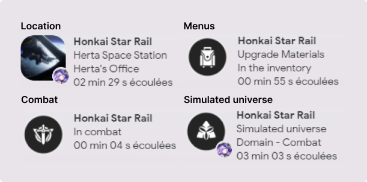

<p align="center"></p>

<p id="description">Add Honkai Star Rail status to Discord with locations, characters, bosses, simulated universe, forgotten hall, 130+ menus supported and more.</p>

<h2>🖼️ Project Screenshots:</h2>

<div align="center">
  
</div>

<h2>💻 Platforms:</h2>

- [x] Windows 10 64-bit or higher
- [ ] Linux
- [ ] MacOs

<h2>🗣️ Languages:</h2>

- [x] English
- [ ] French

<h2>🤓 Technical information:</h2>

This program works with [tesseract](https://github.com/tesseract-ocr/tesseract), an open source text recognition software. hsrpc extracts no data from the game and is based solely on what tesseract recognizes on the window (so some results may be wrong)

<h2>🦀 Why a rust rewrite:</h2>

Honestly, the legacy code in Go was a bit messy and didn't allow me to release new features quickly and cleanly. I also wanted to improve the user experience by offering a pleasant, easy-to-use application. Now it's just a click to install the application with tesseract directly bundled.

Tauri gives me the right balance between performance, bundle size, user and developer experience.

<h2>🛠️ Installation Steps:</h2>

<p>1. Install hsrpc installer</p>

Get an installer from the [latest release](https://github.com/X3ne/hsrpc/releases/latest) (choose between `.exe` or `.msi` no need to download both)

<p>2. Launch installer</p>

Just run the installer and install hsrpc

<h2>🏗️ Build Steps:</h2>

This project uses [tauri](https://github.com/tauri-apps/tauri) you need to follow the [prerequisites](https://v2.tauri.app/fr/start/prerequisites/) to get started

<p>1. Clone this project</p>

```
git clone https://github.com/X3ne/hsrpc
```

<p>2. Install npm packages</p>

```
pnpm install
```

<p>3. Build the app for development</p>

```
pnpm tauri dev
```

<p>3.5 Build the app for production</p>

```
pnpm tauri build
```

<h2>⚙️ How to get <strong>Window Class</strong> and <strong>Window Name</strong>:</h2>

These values should only be changed if your game window is not found. To find these values, you need to :
- Install [WinSpy++](https://github.com/strobejb/winspy) and launch the .exe
- Enlarge window
- Launch your task manager, right-click on `Name` and activate `PID` if it's not already activated
- Find the `Star Rail` process and extend it, pick the `Star Rail` process PID
- Return to WinSpy++ and find the `PID` from the previous step, double-click and select the `UnityWndClass` window. Now you have the `Caption` and `Class`, these values must be entered in **Window name** and **Window class** respectively

<h2>🪲 Known issues:</h2>

- [ ] I don't have these characters, but `Dan Heng Imbibitor Lunae` and `Topaz and Numby` seem broken with ocr detection (due to their long name)

<h2>⚒️ Improvements:</h2>

- [ ] Create a community based db for menus with a simple way in the ui to add entries
- [ ] Add support for the forgotten hall (add some data to detect the current level)
- [ ] Add support for cut scenes
- [ ] Add support for the Trailblazer
- [ ] I want to add more infos for the selected character in the character tab (like the character name, level...)
- [ ] Reimplement the personalization of coordinates in GUI

<h2>🎨 Credits:</h2>

The assets and data for the discord presence come from the [Honkai Star Rail wiki](https://honkai-star-rail.fandom.com/wiki/Honkai:_Star_Rail_Wiki)

The [app icon](https://x.com/SuonikoArt/status/1801902328108507275) by Suoniko

Image assets are intellectual property of HoYoverse, © All rights reserved by miHoYo
