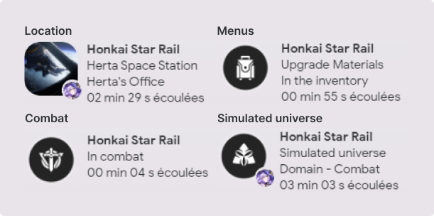

<!-- 

 -->

Add Honkai Star Rail status to Discord with locations, characters, bosses, simulated universe, forgotten hall, 130+ menus supported and more.

<h2>🖼️ Project Screenshots:</h2>

  

<h2>💻 Platforms:</h2>

- [x] Windows 10 64-bit or higher
- [ ] Linux
- [ ] MacOs

<h2>🗣️ Languages:</h2>

- [x] English
- [ ] French

<h2>🤓 Technical information:</h2>

This program works with [tesseract](https://github.com/tesseract-ocr/tesseract), an open source text recognition software. hsrpc extracts no data from the game and is based solely on what tesseract recognizes on the window (so some results may be wrong)

<h2>🛠️ Installation Steps:</h2>

1. Install hsrpc installer

Download the file named `hsrpc_windows_amd64.zip` and extract the executable (.exe) to the desired location

[Latest release](https://github.com/X3ne/hsrpc/releases/latest)

3. Launch

Just run the executable and off you go

<h2>🏗️ Build Steps:</h2>

<h2>⚙️ Configuration:</h2>

When you launch the `.exe` file you can configure some settings with the GUI app. To open the GUI just go to your **windows systray** and **right click** to open the config.

<h3>Settings:</h3>

**Player UID**: Enter your hsr UID to display your level and player name (you can disable both with the 2 checkboxes). If no **Player Name** is entered, this value is used to detect whether your Trailblazer is the currently selected character.

**Player name**: Enter your player name to activate Trailblazer detection (this value is optional if you've entered your UID).

**Loop time**: This is the time that elapses between two loop executions. If you're experiencing performance issues, you can increase this value (in milliseconds).

**Preprocess treshold**: You can adjust this value by checking screenshots inside `C:\Users\<user>\AppData\Roaming\hsrpc\tmp` (you need to see the text on the images when using the app). If you have `Lost in the space-time continuum` status this means you may need to lower this value.

**Tesseract path**: You can change the path to tesseract.exe if the default path does not match your tesseract installation.

**Window class** and **Window name**: These values should only be changed if your game window is not found (you can check that the loop time is 20s in the `Presence` tab, or simply by checking the application logs). To find these values, you need to :
- Install [WinSpy++](https://github.com/strobejb/winspy) and launch the .exe
- Enlarge window
- Launch your task manager, right-click on `Name` and activate `PID` if it's not already activated
- Find the `Star Rail` process and extend it, pick the `Star Rail` process PID
- Return to WinSpy++ and find the `PID` from the previous step, double-click and select the `UnityWndClass` window. Now you have the `Caption` and `Class`, these values must be entered in **Window name** and **Window class** respectively

<h2>🪲 Known issues:</h2>

- [ ] I don't have these characters, but `Dan Heng Imbibitor Lunae` and `Topaz and Numby` seem broken with ocr detection (due to their long name)

<h2>⚒️ Improvements:</h2>

- [ ] Add support for the forgotten hall (add some data to detect the current level)
- [ ] Add support for cut scenes
- [ ] Add support for the Trailblazer
- [ ] I want to add more infos for the selected character in the character tab (like the character name, level...)
- [ ] Reimplement the personalization of coordinates in GUI

<h2>🎨 Credits:</h2>

The assets and data for the discord presence come from the [Honkai Star Rail wiki](https://honkai-star-rail.fandom.com/wiki/Honkai:_Star_Rail_Wiki)

The [app icon](https://www.deviantart.com/mhesagnta/art/Chibi-Silver-Wolf-Honkai-StarRail-Render-965316702) by mhesagnta

Image assets are intellectual property of HoYoverse, © All rights reserved by miHoYo
